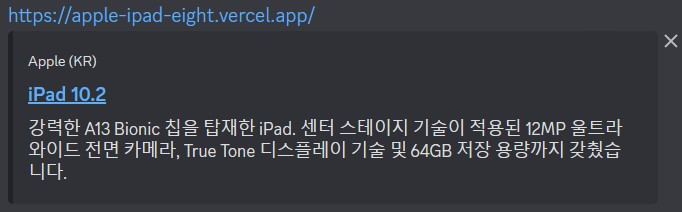

[](https://app.netlify.com/sites/my-apple-ipad/deploys)


# 🍎 Apple-iPad Responsive Website

<div align="center">

</div>

---

# :bell: Visit the site

➡️ [<u>Go to Site</u>](https://my-apple-ipad.netlify.app/ "Open page") / [<u>Vercel Deploy</u>](https://apple-ipad-eight.vercel.app/)

## 🧐 About

Apple iPad main page with simple interactive features. It provides various animations and new features that is not used in previous Starbucks project. Also, it provides responsive web, at width `1000px` and `740px`.

## 💡Features

- Sliding animation when click search icon.
- Autocomplete section appears when click search icon.
- Blur effect when focused on search tab.
- Basket section appears when click basket button.
- Move back to original setting when click other part then focused section.
<div align = "center">

</div>

- Prevents users from drag or select the image or figcaption.
- CSS sprite image.
- Intersection Observer of info section.
<div align = "center">

</div>

- Footnote.
<div align = "center">

</div>

- Two different responsive modes available: width `<=1000px`, `<=740px`.
  - Can manipulate by changing window size..

## ⛏️Built with

- 
- 
- 
- 

## 📑 Initial Settings

⚠️ Most of the settings are similar with previous Starbucks Project. For more information, visit [Starbucks project](https://github.com/0112shpark/Starbucks-page-clone)

<h3>🔥Favicon(favorite icon)</h3>

---

Favicon is a logo that represents the page.  
It can be found next to Web Page title on 'tab'.

⚡Use `favicon.ico`

1. Generate `.ico` file at [iconifier.net](https://iconifier.net/)
2. Place `favicon.ico` file at root directory.
3. It will be automatically set as favicon.


<br></br>

<h3>🔥Reset-CSS</h3>

---

Reset the Browser's CSS style for Cross Browsing.

```html
<link
  rel="stylesheet"
  href="https://cdn.jsdelivr.net/npm/reset-css@5.0.1/reset.min.css"
/>
```

<h3>🔥Open Graph Protocol</h3>

---

Set the preference information when using Social network.

<div align = "center">

**_KakaoTalk_**

<br>

**_Discord_**



</div>
<br>
⬇️ Following codes are used in my project. ⬇️  
<br></br>

```html
<meta property="og:type" content="website" />
<meta property="og:site_name" content="Apple (KR)" />
<meta property="og:title" content="iPad 10.2" />
<meta
  property="og:description"
  content="강력한 A13 Bionic 칩을 탑재한 iPad. 센터 스테이지 기술이 적용된 12MP 울트라 와이드 전면 카메라, True Tone 디스플레이 기술 및 64GB 저장 용량까지 갖췄습니다."
/>
<meta property="og:image" content="./images/ipad-seo.png" />
<meta property="og:url" content="https://my-apple-ipad.netlify.app/" />
```

- `og:type` : Type of page (Ex: `website`, `video.movie`)
- `og:site_name` : Name of the page it belongs to
- `og:title` : Title of the pate
- `og:description` : Simple description of the page
- `og:image` : Path of the page's representative icon
- `og:url` : URL of the page

<br>🐤<strong>Twitter Card</strong>

---

Twitter card is similar with Open Graph Protocol, but it's used when using Twitter.

⬇️ Codes for Twitter Card in my project. ⬇️

```html
<meta property="twitter:card" content="summary" />
<meta property="twitter:site" content="Apple (KR)" />
<meta property="twitter:title" content="iPad 10.2" />
<meta
  property="twitter:description"
  content="강력한 A13 Bionic 칩을 탑재한 iPad. 센터 스테이지 기술이 적용된 12MP 울트라 와이드 전면 카메라, True Tone 디스플레이 기술 및 64GB 저장 용량까지 갖췄습니다."
/>
<meta property="twitter:image" content="./images/ipad-seo.png" />
<meta property="twitter:url" content="https://my-apple-ipad.netlify.app/" />
```

- `twitter:card` : Type of page(card) (Ex: `summary`, `player`)
- `twitter:site` : Name of the page it belongs to
- `twitter:title` : Title of the page
- `twitter:description` : Simple description of the page
- `twitter:image` : Path of the page's representative icon
- `twitter:url` : URL of the page

<h3>🔥Google Fonts and Material Icons</h3>

---

⭐ Following Fonts are used in this project.

- `Roboto`: Regular 400, medium 500, bold 700.
- `Noto Sans Korean`: Regular 400, bold 700.

🎯 <strong>Steps</strong> 🎯

1. Go to Google Font Site.
   > [Google Font](https://fonts.google.com/ "Google Font")
2. Search for `Roboto`.
3. Add `Regular 400`, `medium 500` and `Bold 700`.
4. Search for `Noto Sans Korean`.
5. Add `Regular 400` and `Bold 700`.
6. Copy the `link` section and paste in `head` tag.
   > `link` tag should be inserted before `css link` tag!

```html
<link rel="preconnect" href="https://fonts.googleapis.com" />
<link rel="preconnect" href="https://fonts.gstatic.com" crossorigin />
<link
  href="https://fonts.googleapis.com/css2?family=Noto+Sans+KR:wght@400;700&family=Roboto:wght@400;500;700&display=swap"
  rel="stylesheet"
/>
```

5. copy `css rules` and paste in `body` tag selector in css file.

```css
body {
  font-size: 16px;
  line-height: 1;
  font-family: "Roboto", "Noto Sans KR", sans-serif;
  word-break: keep-all;
}
```

🎈 `word-break` justifies newline property.

> `keep-all` value makes the newline to be inserted by end of words.

<br>
⭐ Using Google Meterial Icons <br></br>

> ❕Material icons are treated as `font`.

🎯 <strong>Steps</strong> 🎯

1. Paste Following code in `head` tag.
   > `link` tag should be inserted before `css link` tag!

```html
<link
  rel="stylesheet"
  href="https://fonts.googleapis.com/icon?family=Material+Icons"
/>
```

2. Go to Google Material Icons ite.
   > [Google Material Icons](https://fonts.google.com/icons?selected=Material+Icons "Google Material Icons")
3. Search for Icons to use.
4. Write code in following format.
   > Just change the `search` part to name of icon.  
   > Leave the class name as `material-icons`

```html
<div class="material-icons">search</div>
```

<h3>🔥Vender Prefix</h3>

---

For certain properties of `CSS`, we need to add `-webkit-` prefix to use at browsers.

⬇️ Examples. ⬇️

```css
img {
  display: block;
  user-select: none;
  -webkit-user-drag: none;
}
```

## 📚 Libraries

## ✒️ CSS Knowledges

<h3>🍊 Properties</h3>

---

<h4>

🔖 `backdrop-filter`

</h4>

This property sets its backgroud filter.

```css
nav {
  background-color: rgba(255, 255, 255, 0.7);
  backdrop-filter: blur(20px);
  border-bottom: 1px solid #d2d2d2;
  position: sticky;
  top: 0;
  z-index: 8;
}
```

- This code makes backgroud blur by 20px.

<h4>

🔖 `user-select`, `user-drag`

</h4>

This property decides users whether to select or drag the section.

```css
img {
  display: block;
  user-select: none;
  -webkit-user-drag: none;
}
```

- This code prevents users from select or drag the img.

<h3>🍊 Grammers</h3>

---

<h4>📎 Css variables</h4>

Like other languages, we can declare `variables` in CSS.

Using `--{name}: {value}`, we can declare a variable.  
By using `property : var({name})`, we can assign a variable.

⬇️ Example ⬇️

- Declare

```css
html {
  --color-white: #fff;
  --color-black: #000;
  --color-font: #1d1d1d;
  --color-font-darkgray: #6e6e6e;
  --color-font-lightgray: #f5f5f5;
  --color-link: #0071e3;
  --color0link-focus: #81b9f1;
  --color-border: #d2d2d2;
  --color-header: #3a3a3a;
  --color-section: #f5f5f5;
  --color-shadow: rgba(0, 0, 0, 0.4);
}
```

> ❕Custom properties are subject to the cascade and inherit their value from their parent.

- Assign

```css
body {
  font-size: 16px;
  line-height: 1;
  font-family: "Roboto", "Noto Sans KR", sans-serif;
  word-break: keep-all;
  color: var(--color-font);
  height: 10000px;
}
```

<h4>📎 Sprite Animation method</h4>

Making an animation with only one image by moving position of the image.

⬇️ Example ⬇️

I used 60 images for one animation.

- css

Declare animation

```css
@keyframes sprite-icon {
  /* 1~60 */
  0.00% {
    background-position: 0 0;
  }
  1.67% {
    background-position: -100px 0;
  }
  ... 96.67% {
    background-position: -400px -900px;
  }
  98.33% {
    background-position: -500px -900px;
  }
}
```

Use in CSS grammer

```css
.info .icon {
  width: 100px;
  height: 100px;
  margin: 0 0 -15px -30px;
  animation: sprite-icon 3s steps(1) infinite;
}
```

✔️ Using `step(1)`, We can eliminate translation animation.

🔺Additional Javascript code to generate 60 `@keyframe`.

```javascript
let x = 0;
let y = 0;
let frames = "";
for (let i = 0; i < 60; i += 1) {
  frames += `${((100 / 60) * i).toFixed(2)}% { background-position: ${x}${
    x === 0 ? "" : "px"
  } ${y}${y === 0 ? "" : "px"}; }\n`;
  if (x <= -500) {
    x = 0;
    y -= 100;
    continue;
  }
  x -= 100;
}

console.log(frames);
```

## ✏️ Javascript Knowledges

 <h3>🔍Event Bubbling</h3>

---

> Event bubbling is a type of DOM event propagation where the event first triggers on the innermost target element, and then successively triggers on the ancestors (parents) of the target element in the same nesting hierarchy till it reaches the outermost DOM element or document object. (Wikipedia)

📌 By using `event.stopPropagation()` function, we can stop events from propagating to further ancestor.

⬇️ Use `event.stopPropagation()` to make basket appear in certain situation ⬇️

- <h5> Javascript</h5>

```javascript
const basketStarterEl = document.querySelector("header .basket-starter");
const basketEl = basketStarterEl.querySelector(".basket");

basketStarterEl.addEventListener("click", function (event) {
  event.stopPropagation(); // allows basket to appear
  if (basketEl.classList.contains("show")) {
    //check if it contains certain class
    //hide
    basketEl.classList.remove("show");
  } else {
    //show
    basketEl.classList.add("show");
  }
});
basketEl.addEventListener("click", function (event) {
  event.stopPropagation();
});
window.addEventListener("click", function () {
  basketEl.classList.remove("show");
});
```

✔️ By adding `event.stopPropagation()` in `basketStarterEl`, we stop click event to propagate to its ancestor. When we click basket button, even though its section is window, this function stops event to propagate, and

```javascript
window.addEventListener("click", function () {
  basketEl.classList.remove("show");
});
```

this function does not run. So it allows basket class to keep `show`class, which then makes section to appear.

✔️ Same logic is applied when we click basket section while it's on screen.

 <h3>🔍Intersection Observer</h3>

---

> Identify whether certain class or section is in the view port of the page.

📌 By createing `IntersectionObserver`, we can track whether certain section is in the page.

- javascript

```javascript
// Intersection Observer
const io = new IntersectionObserver(function (entries) {
  entries.forEach(function (entry) {
    if (!entry.isIntersecting) {
      return;
    }
    entry.target.classList.add("show");
  });
});
const infoEls = document.querySelectorAll(".info");
infoEls.forEach(function (el) {
  io.observe(el);
});
```

✔️ `observe` method tracks OnPage informations(class, isIntersecting, target...etc) about `el` variable, which contains `info` class.

✔️ By checking `isIntersecting` boolean value, we can handle the animation, such as translation when certain section enters the page when scrolling.
